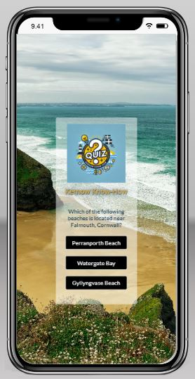

<h1>Kernow Know-How README.MD</h1>

<h2>Introduction</h2>

**Kernow Know-How** by Kernow Coders is an online quiz designed to allow users to test and enhance their knowledge of Cornwall. 

Suitable for a broad target audience from age 12 upwards, the is resource could also be used by older primary school aged children, for example when doing a school project. The quiz will provide 10 questions selected randomly from a bank of suitable material.

Future additions will enable the user to test and enhance their knowledge on a wide variety of topics after they have completed the Cornish section of the quiz as well as allowing them to enter their details to save their progress. 

## Main Page 

The user is greeted with a beautiful image of a Cornish beach to tie in with the theme of the quiz.

It displays the Kernow Know-How brand logo clearly for brand recognition. Future features will provide the option to share the page and the user's scores with friends and family on social media.

A simple but effective start button is present so that the user knows immediately how to begin the game.

<strong>Main page across multiple devices.</strong>

 

<strong>Quiz view.</strong>
 
 Once the start button is clicked the questions are displayed with a choice of 3 possible answers.

 

<strong>Quiz view showing a selected correct answer and the score counter.</strong>

While the game is being played the user can choose an answer by clicking the relevant button. If the answer is correct the button will turn green and the score will increment by 1.

 

<strong>Quiz view showing a selected wrong answer and the score counter.</strong>

If the answer selected by the user is wrong the button will turn red and the score will not change.

 

<strong>The end of the quiz.</strong>

At the end of the quiz the score is displayed along with a message that depends on that score. A reset button will also appear fothe user to play again. 

 

<strong>Quiz view on a small screen.</strong>

In order to provide a better user experience on a smaller screen the answer buttons appear in a column.

<strong>End game on a small screen.</strong>

In future this will be fixed so that the questions dissappear on the final screen.

