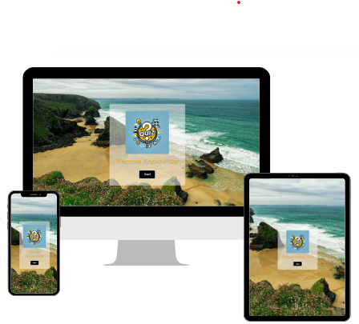
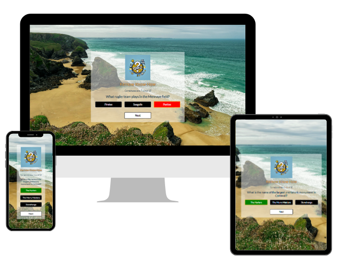
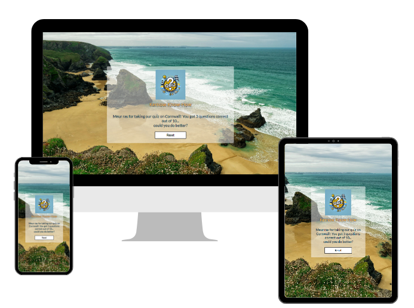
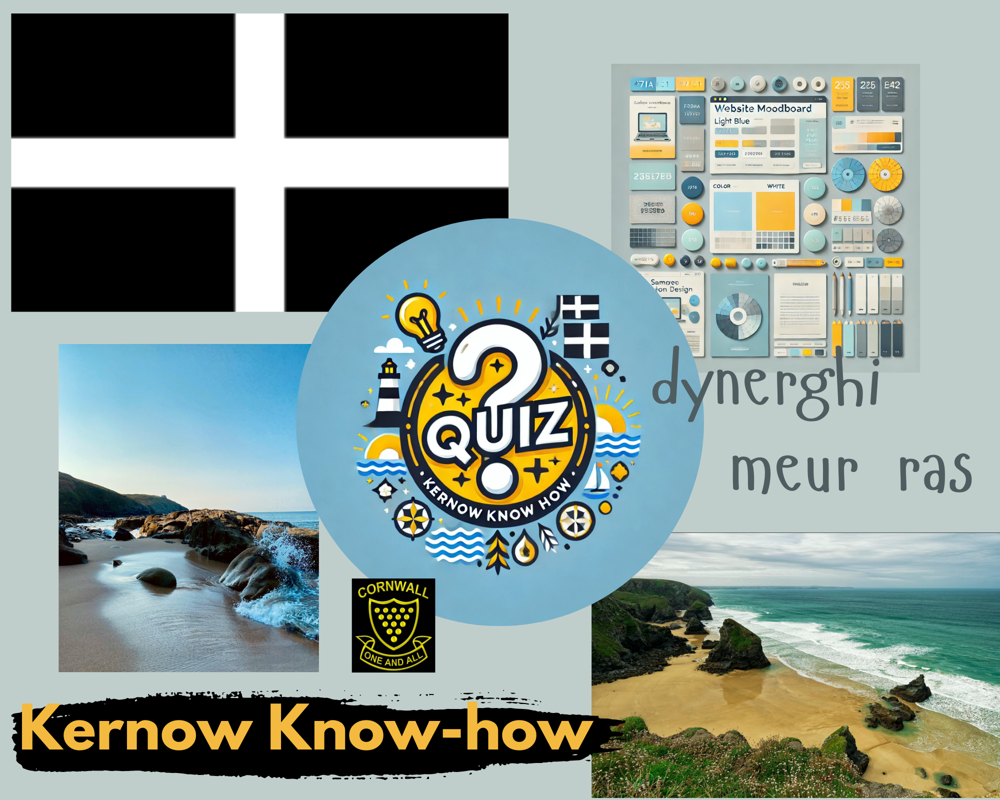
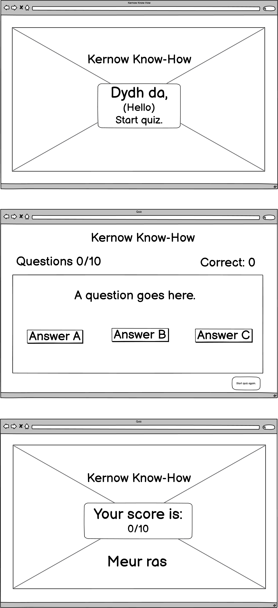
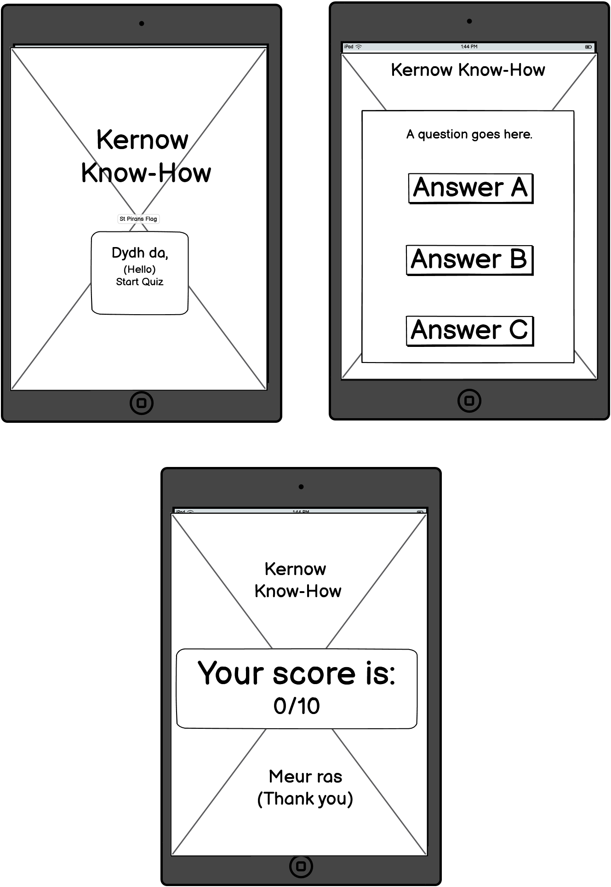
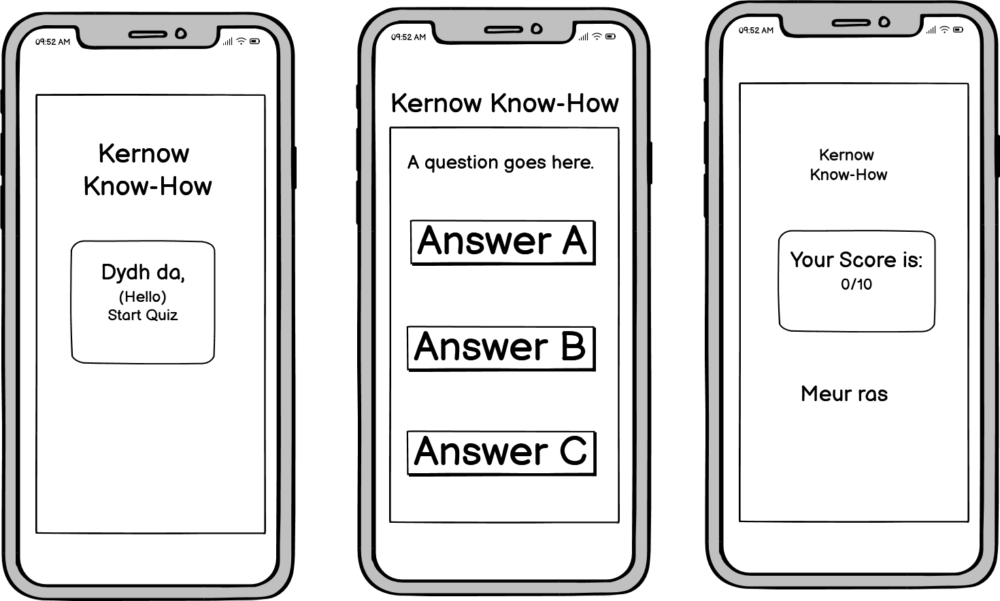
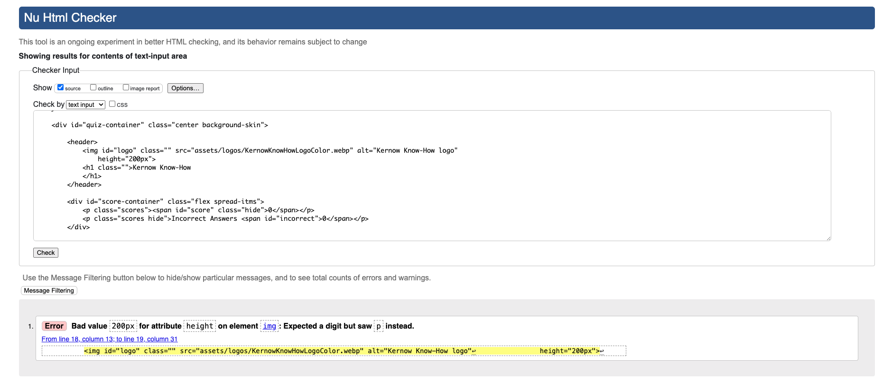
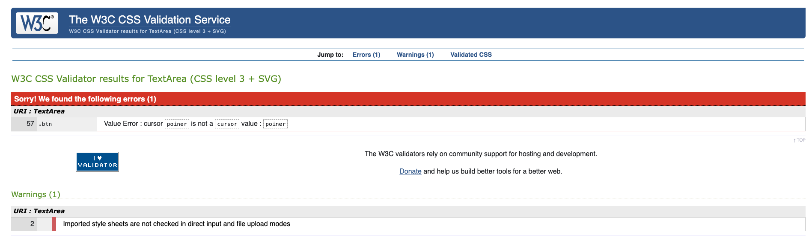

<h1>Kernow Know-How README.MD</h1>

<h2>Introduction</h2>

**Kernow Know-How** by Kernow Coders is an online quiz designed to allow users to test and enhance their knowledge of Cornwall.

Suitable for a broad target audience from age 12 upwards, the is resource could also be used by older primary school aged children, for example when doing a school project. The quiz will provide 10 questions selected randomly from a bank of suitable material.

Future additions will enable the user to test and enhance their knowledge on a wide variety of topics after they have completed the Cornish section of the quiz as well as allowing them to enter their details to save their progress.

## Main Page

The user is greeted with a beautiful image of a Cornish beach to tie in with the theme of the quiz.

It displays the Kernow Know-How brand logo clearly for brand recognition. Future features will provide the option to share the page and the user's scores with friends and family on social media.

A simple but effective start button is present so that the user knows immediately how to begin the game.

<strong>Main page across multiple devices.</strong>

 

<strong>Quiz view.</strong>

Once the start button is clicked the questions are displayed with a choice of 3 possible answers.

 

<strong>Quiz view showing a selected correct answer and the score counter.</strong>

While the game is being played the user can choose an answer by clicking the relevant button. If the answer is correct the button will turn green and the score will increment by 1.

 

<strong>Quiz view showing a selected wrong answer and the score counter.</strong>

If the answer selected by the user is wrong the button will turn red and the score will not change.

 

<strong>The end of the quiz.</strong>

At the end of the quiz the score is displayed along with a message that depends on that score. A reset button will also appear fothe user to play again.

 

<strong>Quiz view on a small screen.</strong>

In order to provide a better user experience on a smaller screen the answer buttons appear in a column.

## Quiz page

We have chosen a fun trivia quiz based on Cornish general knowledge.

<strong>In-quiz page across multiple devices</strong>

<strong>Mid-quiz page showing answer committed and feedback provided</strong>

<strong>Quiz complete screen</strong>

## Design Choices

For our project, we chose a colour palette inspired by a beautiful Cornish beach. We opted for blue and yellow as the primary colours. The blue represents the rolling waves of the sea, while the yellow reflects the Cornish sand. The golden yellow also features in the Cornish logo.

## Wire Frames

We have included the wireframes for each stage of the user journey, including the initial page, the quiz page, and the final page.

<strong>Wireframe for web browser.  </strong>

<strong>Wireframe for tablet.  </strong>

<strong>Wireframe for mobile.  </strong>

## User Stories, features and bugs

<table>

  <tr>
    <th>User Story</th>
    <th>Features</th>
    <th>Bugs / Issues</th>
  </tr>

  <tr>
    <td>As a User, I want to test my knowledge about Cornwall, so I can see how well I know the region. </td>
    <td>Questions could include identifying landmarks, beaches, and towns on a map, or recognizing key geographical features.</td>
    <td>None detected</td>
    </tr>

  <tr>
    <td>As a User, I want the quiz to have a clean and modern design, so it is visually appealing and easy to navigate.</td>
    <td>High-quality images and icons making quiz engaging and visually rich</td>
    <td>None detected</td>
  </tr>

  <tr>
    <td>As a user, I want to be able to start the quiz.</td>
    <td>Page loads and includes necessary event listeners</td>
    <td>None detected</td>
  </tr>

  <tr>
    <td>As a User, I want to be able to track my score, so I can measure my progress and improvement.</td>
    <td>Current score display to keep score updating</td>
    <td>None detected</td>
  </tr>

  <tr>
    <td>As a User, I want to answer multiple-choice questions, so I can select from given options.
    </td>
    <td>Three buttons with possible choices </td>
    <td>None detected</td>
  </tr>
  
  <tr>
    <td>As a user, I want to be able to restart the game once I’ve finished.</td>
    <td>Play restart button at bottom of page when quiz complete</td>
    <td>Questions to do not reset correctly if user achieves a score of zero</td>
  </tr>

  <tr>
    <td>As a user, I want to be greeted by name when I enter the website for personalisation and to feel welcome.</td>
    <td>Input Name field and have name saved when user returns (cookies required)</td>
    <td>Ran out of time, feature for future iterations</td>
  </tr>

  <tr>
    <td>As a user I want be able to select the quiz topic so that I can learn more about a topic.</td>
    <td>Option to change quiz topic to another topic in future after completing the Cornish quiz topic.</td>
    <td>Ran out of time, feature for future iterations</td>
  </tr>

  <tr>
    <td>As a user I want to be able to share the fun I am having doing the quiz, and challenge my friends.</td>
    <td>"Share with friends" copy link button. Post to FB / Instagram / X clickable icons.</td>
    <td>Ran out of time, feature for future iterations</td>
  </tr>

  <tr>
    <td>As a site owner I want to increase the visibility and thus usership of our website.</td>
    <td>"Share with friends" copy link button. Post to FB / Instagram / X clickable icons.</td>
    <td>Ran out of time, feature for future iterations</td>
  </tr>

  <tr>
    <td>As a Cornish user, I would like to be able to take the quiz in Cornish.</td>
    <td>Add the option to change the language of the quiz to Cornish. Or add a Cornish Translation Switch toggle for questions and answers.</td>
    <td>Ran out of time, feature for future iterations</td>
  </tr>

  </table>

 

 

### User Stories and Features (to be implelemented next Sprint)

  <table>
  <tr>
    <th>User Story</th>
    <th>Features</th>
    <th>Bugs / Issues</th>
  </tr>

  <tr>
    <td>As a user, I want to be able to view my previous scores and see my personal best.</td>
    <td>Highest score from previous use visible (cookies required)</td>
    <td>N/A</td>
  </tr>
  </tr>

  </table>

### Won't haves

  <table>
  <tr>
    <th>User Story</th>
    <th>Features</th>
    <th>Bugs / Issues</th>
  </tr>
  <tr>
    <td>As a Cornish user, I would like to take the Cornwall quiz in Cornish.</td>
    <td>A translation toggle where the user can switch between Cornish text and English.</td>
    <td>N/A</td>
  </tr>
    
 <tr>
    <td>As a user, I would like to be able to share my score with others.</td>
    <td>Social media links are displayed upon the completion of the quiz.</td>
    <td>N/A</td>
  </tr>

  <tr>
    <td>As a user, I would like the game to display my name when I'm playing.</td>
    <td>Input name box would take the users name at the start, then have a customised user greeting message.</td>
    <td>N/A</td>
  </tr>
    <tr>
    <td>As a user I want to link with my friends and compare scores.</td>
    <td>Highest score which links to other users with log in details.</td>
    <td>N/A</td>
  </table>

## Fixed Bugs / Issues

 
<table>
  <tr>
    <th>Bug/Issue</th>
    <th>Resolution</th>
  </tr>
  <td>The Reset button would not appear after the last question.</td>
     
  <td>We moved the function to an earlier point in the call list to ensure this function was called first. </td>
  </tr>
      
  </tr>
    <td>The answer buttons would not shrink to fit on mobile screen</td>
    <td>We added media queries to aid responsiveness</td>
  </tr>
      
  </tr>
    <td>The answer buttons were appearing on the end message when the media query was hit for small devices.</td>   
    <td>Issue was caused by the query applying display flex to the answers container, and overriding the display none value. This was fixed by creating a function that hides each answer button element individually.</td>
  </tr>

  <tr>
    <td>The questions were not shuffling properly from the original array.</td>
    <td>The issue was that the return of the shuffle function was not returning the correct values. This was fixed by correcting an issue in the arrow function used to assign the random number to the sort method.</td>
  </tr>
  </table>

## Unfixed Bugs / Issues

 
<table>
  <tr>
    <th>Bug/Issue</th>
    <th>Resolution</th>
  </tr>

 <tr>
  <td>If a user gets 10 question wrong in a row, then the statement applying hide to the score counter suddenly appears as 0 when the results message is given.</td>
  <td>We ran out of time to fix this, but it would be a simple matter of adding a statement to alter the class only if it is already in a specific state.</td>
 </tr>
<table>

### Tools and Technologies Used

- HTML5

- CSS3

- Javascript

- Gitpod - Code Institue cloud IDE

- [Google Fonts](fonts.google.com)

- [ColorZilla](https://chromewebstore.google.com/detail/colorzilla/bhlhnicpbhignbdhedgjhg)

- [Pexels](https://www.pexels.com/photo/rocky-seashore-landscape-at-carnewas-bedruthan-england-18810828/)

- [Tinypng.com](Tinypng.com)

### Accessibility Considerations

- Utilising contrasting colours for the design and themes
- Adding ALT tags to images and icons
- Ensuring links open in new tabs when clicked

## AI Tools Usage

- Utilised Google Gemini, Claude, Perplexity and Chat GPT AI tools to research names for the website
- Used Chat GPT to generate website logo

### Validator Testing

For HTML validation https://validator.w3.org/

One issue detected and fixed.

For CSS validation https://jigsaw.w3.org/css-validator/

One typo detected and fixed. 

  
## Deployment

Site successfully deployed [here.](https://els-390.github.io/CI-Hackathon1-QuizProject/)

## Credits

### Content

Inspiration for quiz style and layout https://github.com/WebDevSimplified/JavaScript-Quiz-App 

Responsiveness displayed on https://ui.dev/amiresponsive

For validation in HTML https://validator.w3.org/

For validation in CSS https://jigsaw.w3.org/css-validator/

For ReadME table https://www.shecodes.io/athena/2362-creating-a-table-with-4-columns-and-4-rows-in-html

Wireframes produced using Balsamiq WireFrames https://balsamiq.com/wireframes/?gad_source=1&gclid=CjwKCAiA44OtBhAOEiwAj4gpOexFh0z3peWS6wolbjlJt_fLq7cZGNu99YeMSIpU89wlL2p6ZluXiRoCOSUQAvD_BwE

## Other General Project Advice

Enjoy the Quiz!
