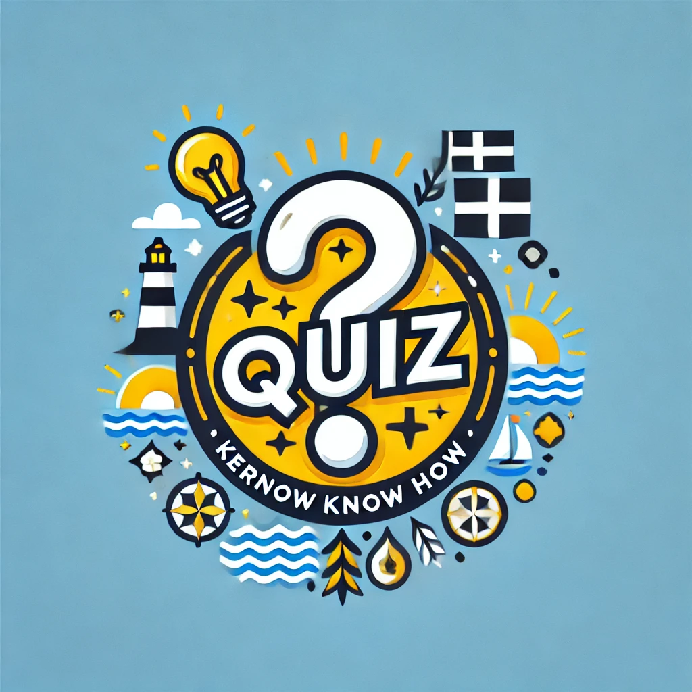
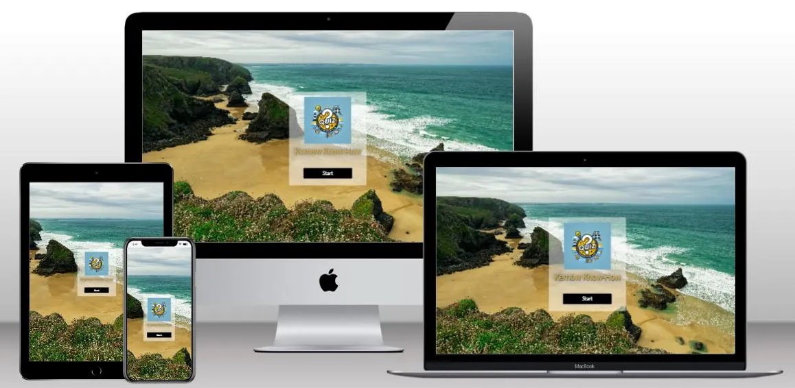
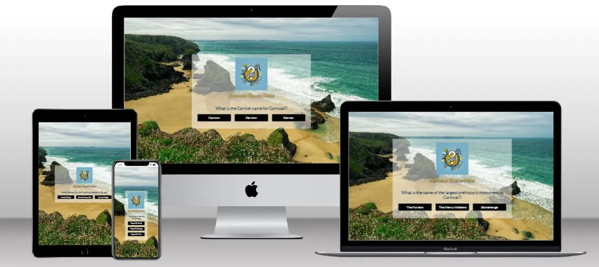
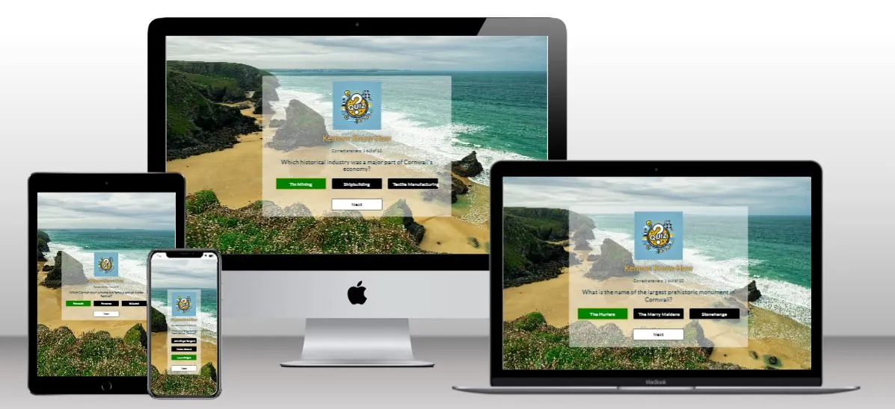
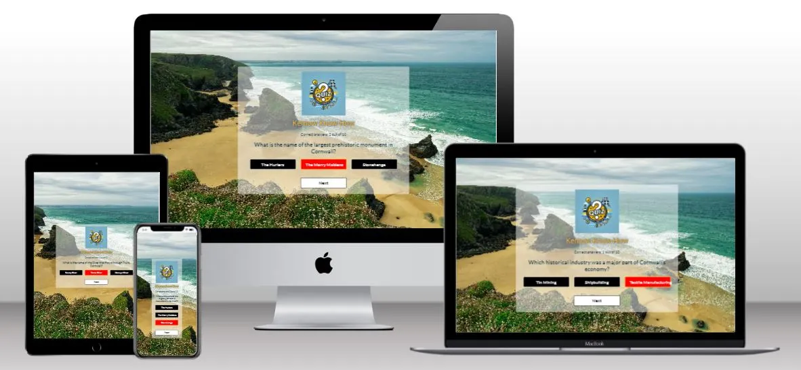
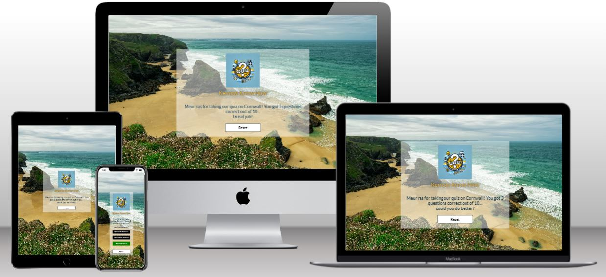
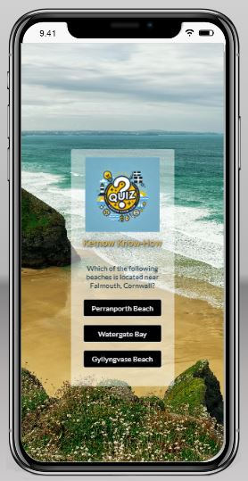

<h1>Kernow Know-How README.MD</h1>

<h2>Introduction</h2>

**Kernow Know-How** by Kernow Coders is an online quiz designed to allow users to test and enhance their knowledge of Cornwall. 

Suitable for a broad target audience from age 12 upwards, the is resource could also be used by older primary school aged children, for example when doing a school project. The quiz will provide 10 questions selected randomly from a bank of suitable material.

Future additions will enable the user to test and enhance their knowledge on a wide variety of topics after they have completed the Cornish section of the quiz as well as allowing them to enter their details to save their progress. 

## Main Page 

The user is greeted with a beautiful image of a Cornish beach to tie in with the theme of the quiz.

It displays the Kernow Know-How brand logo clearly for brand recognition. Future features will provide the option to share the page and the user's scores with friends and family on social media.

A simple but effective start button is present so that the user knows immediately how to begin the game.

<strong>Main page across multiple devices.</strong>

 

<strong>Quiz view.</strong>
 
 Once the start button is clicked the questions are displayed with a choice of 3 possible answers.

 

<strong>Quiz view showing a selected correct answer and the score counter.</strong>

While the game is being played the user can choose an answer by clicking the relevant button. If the answer is correct the button will turn green and the score will increment by 1.

 

<strong>Quiz view showing a selected wrong answer and the score counter.</strong>

If the answer selected by the user is wrong the button will turn red and the score will not change.

 

<strong>The end of the quiz.</strong>

At the end of the quiz the score is displayed along with a message that depends on that score. A reset button will also appear fothe user to play again. 

 

<strong>Quiz view on a small screen.</strong>

In order to provide a better user experience on a smaller screen the answer buttons appear in a column.

 ## Quiz page

 The quiz page presents questions and possible answers, with buttons clearly delineated against their background. 
 
 There is clear feedback when a user selects and then commits an answer. 
 
 It lets you know the correct answer if you were wrong. There is also an updating score display. 

 There is a restart button in case the user decides they want to start again. 

<strong>In-quiz page across multiple devices</strong>

<strong>Mid-quiz page showing answer committed and feedback provided</strong>

<strong>Quiz complete screen</strong>

## Design Choices

We selected a rich and colourful style, using bright high contrast colours. We want the user to feel immersed in the experience of visiting our website. We derived our colours from https://visme.co/blog/website-color-schemes/
“Bright Accent Colors”
#242582
#553D67
#F64C72
#99738E
#2F2FA2

We selected the font style Poppins 'https://fonts.googleapis.com/css2?family=Poppins:wght@300;400;500;600;700;800;900&display=swap'. It works well as a fun, slightly futuristic, slightly unusual font; but not unusual enough to overpower the rest of the page.

## Wire Frames

<strong>Landing page for First Time User followed by Options Pages for repeat users </strong>

## Quiz page

We ensured that we provided wireframes to cover all the different stages of user experience and features

## User Stories, features and bugs

<table>

  <tr>
    <th>User Story</th>
    <th>Features</th>
    <th>Bugs / Issues</th>
  </tr>

  <tr>
    <td>As a User, I want to test my knowledge about Cornwall, so I can see how well I know the region. </td>
    <td>Questions could include identifying landmarks, beaches, and towns on a map, or recognizing key geographical features.</td>
    <td>None detected</td>
    </tr>

  <tr>
    <td>As a User, I want the quiz to have a clean and modern design, so it is visually appealing and easy to navigate.</td>
    <td>High-quality images and icons making quiz engaging and visually rich</td>
    <td>None detected</td>
  </tr>

  <tr>
    <td>As a user, I want to be able to start the quiz.</td>
    <td>Page loads and includes necessary event listeners</td>
    <td>None detected</td>
  </tr>

  <tr>
    <td>As a User, I want to be able to track my score, so I can measure my progress and improvement.</td>
    <td>Current score display to keep score updating</td>
    <td>None detected</td>
  </tr>

  <tr>
    <td>As a User, I want to answer multiple-choice questions, so I can select from given options.
    </td>
    <td>Three buttons with possible choices </td>
    <td>None detected</td>
  </tr>
  
  <tr>
    <td>As a user, I want to be able to restart the game once I’ve finished.</td>
    <td>Play restart button at bottom of page when quiz complete</td>
    <td>Questions to do not reset correctly if user achieves a score of zero</td>
  </tr>

  <tr>
    <td>As a user, I want to be greeted by name when I enter the website for personalisation and to feel welcome.</td>
    <td>Input Name field and have name saved when user returns (cookies required)</td>
    <td>Ran out of time, feature for future iterations</td>
  </tr>

  <tr>
    <td>As a user I want be able to select the quiz topic so that I can learn more about a topic.</td>
    <td>Option to change quiz topic to another topic in future after completing the Cornish quiz topic.</td>
    <td>Ran out of time, feature for future iterations</td>
  </tr>

  <tr>
    <td>As a user I want to be able to share the fun I am having doing the quiz, and challenge my friends.</td>
    <td>"Share with friends" copy link button. Post to FB / Instagram / X clickable icons.</td>
    <td>Ran out of time, feature for future iterations</td>
  </tr>

  <tr>
    <td>As a site owner I want to increase the visibility and thus usership of our website.</td>
    <td>"Share with friends" copy link button. Post to FB / Instagram / X clickable icons.</td>
    <td>Ran out of time, feature for future iterations</td>
  </tr>

  <tr>
    <td>As a Cornish user, I would like to be able to take the quiz in Cornish.</td>
    <td>Add the option to change the language of the quiz to Cornish. Or add a Cornish Translation Switch toggle for questions and answers.</td>
    <td>Ran out of time, feature for future iterations</td>
  </tr>

  </table>

 

 

### User Stories and Features (to be implelemented next Sprint) 

  <table>
  <tr>
    <th>User Story</th>
    <th>Features</th>
    <th>Bugs / Issues</th>
  </tr>

  <tr>
    <td>As a user I want to be able to store my highest score to see if I can beat it on my future visits.</td>
    <td>Highest score from previous use visible (cookies required)</td>
    <td>N/A</td>
  </tr>
  

  </table>

### Won't haves

  <table>
  <tr>
    <th>User Story</th>
    <th>Features</th>
    <th>Bugs / Issues</th>
  </tr>
  <tr>
    <td>As a user, I want to have a countdown timer to challenge myself to answer more quickly.</td>
    <td>A countdown timer to display either how long I have left to answer the question before it assigns to wrong</td>
    <td>N/A</td>
  </tr>
    
 
  <td>As a site-owner I want to have a questions backup in case the API  stops working.</td>
    <td>A secondary API or source of questions in case the first API breaks down</td>
    <td>N/A</td>
  </table>

## Fixed Bugs / Issues
 
<table>
  <tr>
    <th>Bug/Issue</th>
    <th>Image</th>
    <th>Resolution</th>
  </tr>
  <td>"Select type" option overflows to below options box on smaller devices</td>
    <td></td>
    
  <td>We added media queries to ensure effective responsiveness</td>
  </tr>
      
  </tr>
    <td>Quiz-E would display without questions and just show questions marks when user left all questions to default(i.e.Any).</td>
   <td></td>
   <td>We required the user to enter Questions Length, and API call modified to accommodate this by leaving the “any” option off the API call.</td>
  </tr>
      
  </tr>
    <td>Sometimes after answering several questions the questions would stop changing</td>
   <td></td>
    
  <td>The problem lay was that when too many requests were made from the API in too small a space of time. Therefore to fix this we implemented a required delay of three seconds between committing answers</td>
  </tr>
  </table>

## Unfixed Bugs / Issues
 
<table>
  <tr>
    <th>Bug/Issue</th>
    <th>Image</th>
    <th>Resolution</th>
  </tr>
  <td>On large devices the "Enter name" box obscures the brand logo and feels like a pop-up rather than an integrated element of the UX package</td>
    <td></td>
    
  <td>Unfortunately we ran out of time to fix this. We would in future sprints change from an in-browser alert box to a html modal box, that would be styled and centred on the screen etc as part of a user management system.</td>
  </tr>
      
  </tr>
    <td>Sometimes quiz repeats questions, or includes them from higher difficulties. As an example of both, this question came up twice in a quiz set to easy.</td>
    <td></td>
    
  <td>Unfortunately none available as source of questions is the API. The only fix would have been to change the API from a paid provider but this would be costly and we would have had to change too much code by the time we realised</td>
  </tr>
    
  </tr>
  <td>Three second delay between answer and next question</td>
    <td></td>
    <td>The delay was a fix to a bug of the site crashing when too many requests were made from the API in too small a space of time(see "Fixed Bugs" above). The only fix would have been to change the API from a paid provider but this would be costly and we would have had to change too much code by the time we realised</td>
      <tr>
      <td>Only a share to FB button, no instagram or X buttons</td>
       
    <td></td>
    <td> <br Ran out of time to add this sprint, but definitely would be added Instagram and X buttons on a future sprint  </td>
  </tr>
  <tr>
      <td>Spelling errors on website </td>
    <td></td>
    <td>Unfortunately none available as source of questions is the API. The only fix would have been to change the API from a paid provider.</td>
    
    
  <table>
  
  </tr>

  </table>

### Validator Testing 

For HTML validation https://validator.w3.org/

For CSS validation  https://jigsaw.w3.org/css-validator/

  

## Deployment

Site successfully deployed on https://kjwhitehead.github.io/quizzee_rascals/

## Credits 

Color Scheme: “Bright Accent Colors” https://visme.co/blog/website-color-schemes/

### Content 

Timer used to display delay issue https://www.online-stopwatch.com/

Responsiveness displayed on https://ui.dev/amiresponsive

API Questions taken from https://opentdb.com/

Code initially inspired by and re-written https://opentdb.com/

Logo from Canva https://www.canva.com/

For validation in HTML https://validator.w3.org/

For validation in CSS https://jigsaw.w3.org/css-validator/

For ReadME table https://www.shecodes.io/athena/2362-creating-a-table-with-4-columns-and-4-rows-in-html

Wireframes produced using Balsamiq WireFrames https://balsamiq.com/wireframes/?gad_source=1&gclid=CjwKCAiA44OtBhAOEiwAj4gpOexFh0z3peWS6wolbjlJt_fLq7cZGNu99YeMSIpU89wlL2p6ZluXiRoCOSUQAvD_BwE

Timer used to display delay issue https://www.online-stopwatch.com/

## Other General Project Advice

Enjoy the Quiz!
